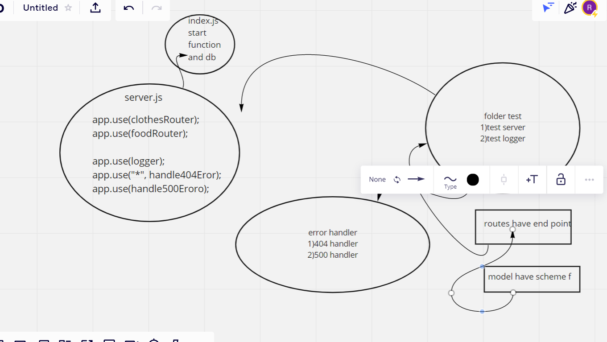

# basic-api-server

## Author: raneem abu jamous

## Setup

### .env requirements

PORT = 3000

### Running the app

npm run dev

## Endpoint: /status

Returns Object
{

"domain": "https://lab03401.herokuapp.com/"

"status": "running",

"port": 3000

}

## Tests

Unit Tests: npm run test

## Heroku applications

main branch
https://lab03401.herokuapp.com/

## Github actions

## actions

https://github.com/raneemabujamous/basic-api-server/actions

## pull request

last pull request https://github.com/raneemabujamous/basic-api-server/pulls

## CI, CD: Continuos Intergration and Continuous Deployment

deppendicies vs devDependiceis

- "dependencies": Packages required by your application in production and deployment.

- "devDependencies": Packages that are only needed for local development and testing.(supertest, jest)

- Postregs for strucured query language as tables .

